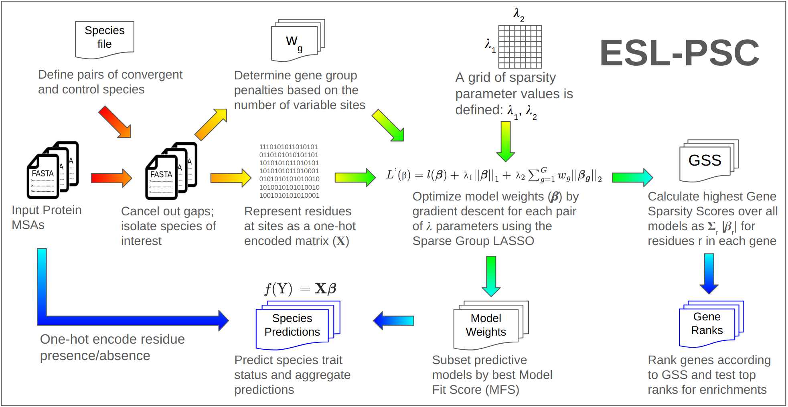
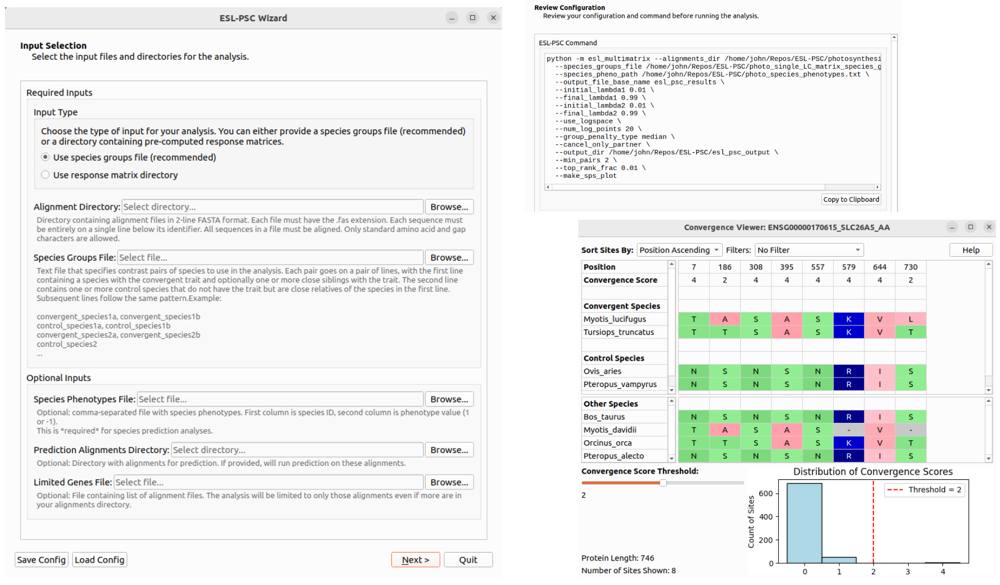
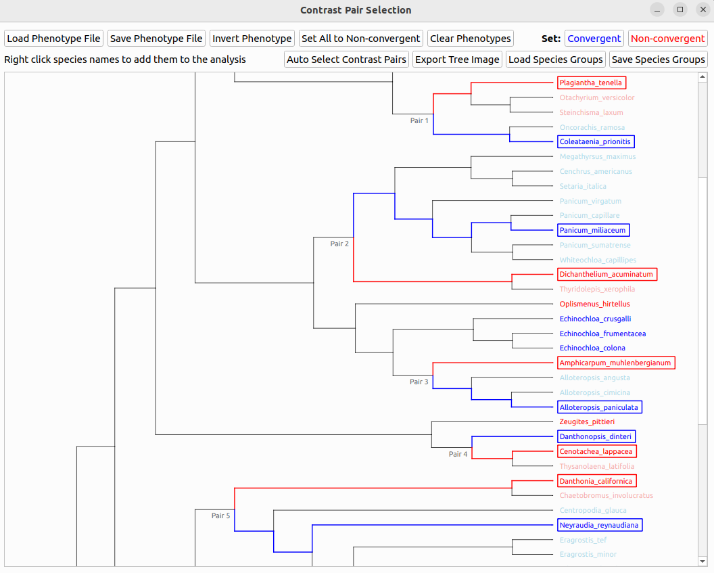
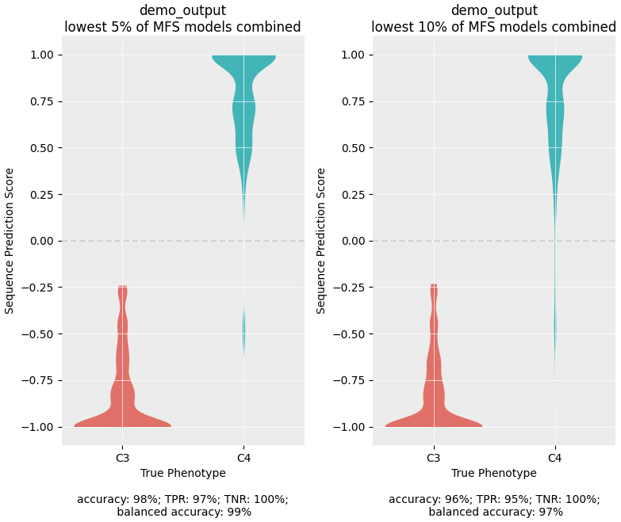

# Evolutionary Sparse Learning with Paired Species Contrast (ESL-PSC) #

[](https://github.com/John-Allard/ESL-PSC/releases/latest)
[](https://github.com/John-Allard/ESL-PSC/actions/workflows/nuitka-build.yml)
[](https://github.com/John-Allard/ESL-PSC/actions/workflows/package-managers.yml)
[](LICENSE)

## Table of Contents ##

1. [Description](#description)
2. [Quick Start](#quick-start)
3. [Installation and Dependencies](#installation-and-dependencies)
4. [Graphical User Interface](#graphical-user-interface)
5. [Command Line Usage](#command-line-usage)
6. [Input Data](#input-data)
7. [Output Data](#output-data)
8. [Additional Options and Parameters](#additional-options-and-parameters)
9. [Included Data](#included-data)
10. [Demo](#demo)
11. [Citation](#citation)

## Description ##
This repository provides GUI and command-line tools for analyzing signatures of molecular convergence in a multiple sequence alignment using Evolutionary Sparse Learning with Paired Species Contrast (ESL-PSC). ESL-PSC takes alignment files and a defined set of species contrast pairs as inputs, preprocesses input data and builds sparse group lasso models to explain the trait of interest. See [Allard et al., 2025, *Nature Communications*](https://www.nature.com/articles/s41467-025-58428-8) for methodological details. 



## Quick Start ##

The GUI is the easiest way to run ESL-PSC. Start with the beginner guide here:

- [`docs/gui-quickstart.md`](docs/gui-quickstart.md)

It shows which GUI download to choose for Mac, Windows, or Ubuntu/Debian Linux, and walks through a first analysis with screenshots. If you prefer the terminal, the command-line tools are described below.

## Installation and Dependencies ##

### Install options

Prepackaged software is available for download.

#### 1. GUI app downloads (macOS/Windows/Linux)

Download the GUI app for your platform from [GitHub Releases](../../releases/latest):


#### 2. CLI Toolkit archive (macOS/Windows/Linux)

The Toolkit provides the CLI for ESL-PSC. Download the toolkit archive for your platform from [GitHub Releases](../../releases/latest):

Then:

1. Extract archive.
2. Use Python 3.10+ to install toolkit Python dependencies:
   `python -m pip install -r requirements-toolkit.txt`
3. Run:
   - `./bin/esl-psc --help` (Linux/macOS)
   - `.\bin\esl-psc.exe --help` (Windows)

#### 3. Build/install from source (most reliable on Linux)

This avoids prebuilt binary issues on some Linux systems.

1. Install Rust toolchain.
2. Install CLI:
   `cargo install --path esl_psc_rs --root /your/install/prefix`
3. Install Python dependencies:
   `python -m pip install -r requirements-toolkit.txt`
4. Set Python linkage for utility subcommands:
   - `ESL_PSC_PYTHON` should point to your Python executable
   - `ESL_PSC_PYTHONPATH` should point to a directory containing `esl_psc_cli` and `gui` modules (the repo root works)

  
## Graphical User Interface ##

If you are new to ESL-PSC and want the simplest path, start with the guide in [`docs/gui-quickstart.md`](docs/gui-quickstart.md).

For a description of the GUI and ESL-PSC Toolkit features, see the [ESL-PSC Toolkit preprint](https://doi.org/10.48550/arXiv.2605.27677).

Install the GUI app from the [GitHub Releases page](../../releases/latest).

Compatible with Windows, Mac, and Linux.



#### Interactive Tree Viewer & Automatic Contrast Pair Selection

The GUI now features an interactive phylogenetic tree viewer that lets you:

* Load a Newick tree and a species phenotype file to visualize convergent and non-convergent clades.
* Assign convergent vs. non-convergent phenotypes by right-clicking species names.
* Visualize phenotypes with colors:
  - Binary values (-1/1) color species labels red/blue.
  - Continuous float values are supported and colored by a red→blue gradient (low→high).
  - Species without phenotype data remain black.
  - Contrast pair coloring takes precedence over phenotype coloring to keep analysis pairs clear.
* Assign species to contrast pairs which are then marked on the tree view.
* Automatically generate sensible convergent/control contrast pairs.
* Save / load phenotype assignments and the species groups file to use in the analysis.  No need to create text or CSV files manually. 
* Export an SVG graphic of the annotated tree graphic with pairs selected to keep track of and display your experimental design.

Simply press **“Create a Species Groups File Using a Newick Tree”** on the first page, then use the toolbar at the top of the viewer.



#### Continuous Phenotype Support

We expanded GUI support for continuous (numeric) phenotypes across the Tree Viewer, analysis options, Site Viewer, and plots:

- Tree Viewer (continuous mode)
  - Load a phenotype file with float values. Species labels are colored by percentile using a Viridis gradient and the numeric value is shown next to each species name.
  - Automatic contrast pair selection supports two continuous workflows:
    - Thresholded binarization: prompt for lower/upper thresholds (with histogram + quantile tails) used only by the auto-selection algorithm.
    - Positive-trait percent contrast: require a minimum percent difference (`upper` vs `lower`) and greedily select closest non-overlapping pairs first.
  - For the positive-trait percent-contrast mode, the GUI can preview a threshold sweep plot (threshold vs selected pair count) before applying a threshold.
  - Tie-breaking options are available when multiple sibling choices are valid: Longest sequence, Shortest distance, Max trait contrast, Composite best, Random, or Simple deterministic.
  - Exported SVGs include the continuous colorbar and low/high labels. In continuous mode, manual binary tools such as Invert Phenotype and Set All to Non‑convergent are disabled by design.

- Analysis modes
  - On the GUI Parameters page, select **Use continuous phenotype values?** to run ESL-PSC with linear regression (ordinary least squares; sg_lasso_leastr) instead of binary logistic regression (CLI: `--use_continuous_phenotypes`). When active, binary SPS plots are disabled by default.
  - For continuous runs, select **Generate phenotype density plot** to create a 2D density plot of true phenotype (X) vs SPS (Y) (CLI: `--make_continuous_plot`).

- Site Viewer: phenotype-aware “Other Species” pane
  - Phenotype values (if provided) are displayed alongside species names, and you can sort “Other” species by Phenotype High → Low or Phenotype Low → High in addition to Alphabetical and MSA Order.

- Plots for predictions
  - Binary phenotypes: violin or KDE SPS plots remain available when a binary phenotype file is supplied.
  - Continuous phenotypes: select the new Phenotype vs SPS density plot (GUI checkbox or `--make_continuous_plot`).

#### Local Contrast Selector for Continuous Traits

- Tree Viewer (continuous mode)
  - Added a local percent-contrast selector for positive-valued continuous traits. This mode picks closest non-overlapping pairs that pass a user-chosen minimum percent-difference threshold.
  - Includes a threshold sweep preview (threshold vs selected pair count) to help choose a cutoff before applying pair selection.

- CLI auto pair selection
  - Added method `pct_contrast` with `--min_pct_diff` for the same local percent-contrast selection workflow.


### Running the GUI from source

If you installed a pre-built GUI package from GitHub Releases, you do not need these steps. Use these instructions only if you want to run the GUI from source after cloning this repo.

1. Ensure the GUI dependencies are installed:
   ```bash
   pip install -r requirements-gui.txt  
   ```
   (You also need the core ESL-PSC requirements listed above.)
2. From the repository root folder, run:
   ```bash
   python -m gui.main
   ```
   The wizard window should appear. Fill in the pages and click **Run** on the final page to start the analysis.
   If you see an error about the `xcb` platform plugin needing
   `libxcb-cursor0`, install the system package first:
   ```bash
   sudo apt install libxcb-cursor0
   ```

Feedback on the GUI is welcome! Please open an issue on the [GitHub repository](https://github.com/John-Allard/ESL-PSC/issues) if you have any questions or suggestions.

### Stand-alone packaged applications ###

Pre-built GUI packages are available for macOS, Windows, and Linux on the [GitHub Releases page](../../releases/latest). We also publish a CLI toolkit package.

The CLI toolkit package includes the compiled `esl-psc` binary plus Python support modules used by utility subcommands such as `pairs` and `site-counter`. It is intended to run with your system Python rather than bundling another Python runtime.
After extracting the toolkit, install dependencies with:

`python3 -m pip install -r requirements-toolkit.txt`

Toolkit release artifacts are versioned by platform as:
`esl-psc-toolkit-v<version>-<os>-<arch>.<tar.gz|zip>`, with companion
`.sha256` and `.manifest.json` files for integrity and metadata.


#### macOS build
1. Download the Apple Silicon GUI release asset for M-series Macs, or the Intel GUI release asset for older Intel Macs.
2. Double-click the `.zip` to extract the `ESL-PSC.app` bundle.
3. Drag `ESL-PSC.app` to your **Applications** folder.
4. Open the app via Launchpad, Spotlight or Finder. Because the build is notarized, macOS should open it without additional warnings. If a confirmation dialog appears, click **Open**.

#### Windows build
1. Download the Windows GUI release asset.
2. Right-click the file and select **Extract All…** (or use your preferred unzip tool).
3. Inside the extracted folder, double-click `ESL-PSC.exe` to launch.

#### Linux build (Debian/Ubuntu amd64)
1. Download the Linux GUI release asset `esl-psc-gui_<version>_amd64.deb`.
2. Install it:
   - GUI: double-click the `.deb` and click **Install**
   - Terminal: `sudo dpkg -i ./esl-psc-gui_<version>_amd64.deb`
3. Launch from your app menu (`ESL-PSC`) or run `esl-psc-gui`.

The `.deb` package is intended for 64-bit Ubuntu, Debian, and closely related Debian-based distributions. If you are on a non-Debian Linux distribution, an ARM Linux system, or prefer to run from source, use the installation options listed above.


## Command Line Usage ##
The main CLI, `esl-psc`, now uses a high-performance unified Rust implementation of the analysis pipeline. It preserves the core CLI behavior while substantially reducing runtime for many analyses.

For a concise overview of the unified command-line interface, configuration-file behavior, checkpointing, and utility subcommands, see:

- [`docs/commands/cli-reference.md`](docs/commands/cli-reference.md)

Quick links:

- Pair selection: [`docs/commands/pairs.md`](docs/commands/pairs.md)
- Site Counter: [`docs/commands/site-counter.md`](docs/commands/site-counter.md)

## Input Data ##

#### The main input files required for ESL-PSC are: ####

1. A directory of alignment files. These should be in **2-line FASTA format** and may use `.fas`, `.fasta`, `.fa`, or `.faa` file extensions. Each sequence should appear entirely on a single line below the line containing its identifier. If the sequence is split over multiple lines, the run will continue but a warning will be issued and the deletion canceler will convert the files to 2-line format, which may be slower. It is assumed that each separate alignment file will be a different genomic component, such as a gene, a protein, an exon, a domain, etc. and each component will be treated as a "group" of sites in the analysis (see Methods in [Allard et al., 2025](https://doi.org/10.1038/s41467-025-58428-8)). In the GUI, choose this folder in the **Alignment Directory** field on the Input page. In the CLI, use `--alignments_dir` and provide the full absolute path to the directory.

2. A species groups file. This is a text file that contains a comma-delimited list of species on each line. In the simplest case, one species identifier can be placed on each line. The first line must contain one or more species that possess the convergent trait under analysis, and the next line must contain one or more species that can serve as trait-negative controls for the species in the first line, such that the first two lines, and each subsequent pair of lines will define a contrast pair of species to use in the analysis (see [Allard et al., 2025](https://doi.org/10.1038/s41467-025-58428-8) for details on choosing contrast pairs for ESL-PSC analysis). When more than one species is given in a line, each of those species will be used in a separate analysis, along with all combinations of other alternative species. Thus, the total number of species combinations can be calculated by the product of the number of species given on each line. In the analysis, species listed on the first line, and subsequent odd numbered lines, will be assigned a response value of 1, and the associated control species on the even numbered lines will be assigned a response value of -1. In the GUI, choose an existing file in the **Species Groups File** field or create one with the Tree Viewer. In the CLI, use `--species_groups_file` and provide the full absolute path to the file.

#### Optional input files: ####

1. A species phenotype file.
   - For analysis, provide a text file with each full species name followed by a comma and then a 1 or -1 for the true phenotype class to which that species belongs. A 1 typically refers to the convergent phenotype. If this file is not provided, the true phenotype will not be listed for each species prediction in the species_predictions output file. In the GUI, choose this file in the **Species Phenotypes File** field on the Input page. In the CLI, use `--species_pheno_path` and provide the full absolute path to the file.
   - The GUI Tree Viewer also accepts continuous float phenotype values for visualization and continuous-trait pair selection. Species labels are colored on a red→blue gradient (low→high). Species without phenotype entries are shown in black. When contrast pairs are assigned, pair colors override phenotype colors for those species.

2. A directory of alignments to use for predictions. By default, any species in the input alignments that are not used in building any given model will be assigned a sequence prediction score (SPS) for that model, which will be included in the predictions output file. As an alternative, you can use a separate directory of alignments for the predictions, however these still need to be fully aligned to any input species alignments or the predictions will be meaningless. In the GUI, choose this folder in the **Prediction Alignments Directory** field on the Input page. In the CLI, use `--prediction_alignments_dir` and provide the full absolute path to the directory.

3. Limited genes list. If you want to use a subset of the alignment files for model building without having to remove files from your alignments directory, provide a limited-genes list file. This is a plain-text file with one alignment file *name* per line and no directory paths. Each name must exactly match a FASTA file in your alignments directory, including the file extension. In the GUI, choose this file in the **Limited Genes File** field on the Input page. In the CLI, use `--limited_genes_list` and provide the full absolute path to this list file.

## Output Data ##

ESL-PSC generates two main types of output files: a Predictions File and a Gene Ranks File. These files will be placed in the output directory selected on the GUI Parameters page or specified in the CLI with `--output_dir`.

#### Predictions File ####
The predictions file contains every prediction made by every model generated using every species combination in the analysis. Each line in the file lists the following information:

1. Species combination (an abbreviated list of the species used to train the model; for very large numbers of species, a name like combo_1 will be assigned instead for each combination)
2. Lambda1 (site sparsity hyperparameter)
3. Lambda2 (gene sparsity hyperparameter)
4. Penalty term (the constant term used to calculate the group penalty, see hyperparameters below for details)
5. Number of genes (the number of genes/proteins with sites included in the model)
6. Input Root Mean Squared Error (RMSE; this is referred to as the Model Fit Score (MFS) by [Allard et al., 2025](https://doi.org/10.1038/s41467-025-58428-8))
7. Species being predicted
8. Sequence Prediction Score (SPS) (a negative value indicates a prediction of the phenotype assigned a response value of -1 and a positive value indicates a prediction of opposite phenotype) 
9. True phenotype for the species (taken from the species_pheno_file if provided)

#### Gene Ranks File ####
The gene ranks file lists the genes (or proteins or other genomic components) used in the analysis, along with information about their rankings based on their model contributions. It is recommended to perform ontology enrichment tests and/or other follow-up analyses on the highest ranking ~1% of genetic elements. Each line in the file includes the following information:

1. Gene name (taken from the alignment file)
2. Number of species combinations in which the gene is ranked (i.e. number of combinations for which it received a non-zero GSS as part of any model)
3. Number of species combinations in which the gene is ranked among the top contributors. The percentage of genes to consider "top genes" by GSS in any model can be set in the GUI advanced parameters or in the CLI with `--top_rank_frac`.
4. Highest ever Group Sparsity Score (GSS)
5. Best ever rank (the best ever rank, 1 being the best possible, received in any model)

## Additional Options and Parameters ##

Detailed command-line options and parameter descriptions are maintained in the CLI reference:

- [`docs/commands/cli-reference.md`](docs/commands/cli-reference.md#options-and-parameters)

CLI users can also run `esl-psc --help` to see the current list of command-line parameters.

## Included Data ##

#### We have included two sample species_groups files for use in ESL-PSC alignments ####
1. `demo_data/photosynthesis/photo_single_LC_matrix_species_groups.txt` (the grass species with the closest contrast partners with the longest sequences (i.e. fewest gaps; used for photosynthesis analyses in [Allard et al., 2025](https://doi.org/10.1038/s41467-025-58428-8)))
2. `demo_data/echolocation/orthomam_echo_species_groups.txt` (this can be used to reproduce the echolocation analyses using all 16 species combinations ([Allard et al., 2025](https://doi.org/10.1038/s41467-025-58428-8))) 

A species phenotype file for the grass species has also been included: `demo_data/photosynthesis/photo_species_phenotypes.txt`

#### We have included the protein sequence alignments used for ESL-PSC analyses by Allard et al. (2025). If you use these data, please cite these sources: ####


##### Grass chloroplast alignments which were used by Allard et al. (2025) were derived from:

Casola C, Li J. 2022. Beyond RuBisCO: convergent molecular evolution of multiple chloroplast genes in C4 plants. PeerJ 10:e12791 https://doi.org/10.7717/peerj.12791
More information regarding these alignments can be found in the supplemental information kindly provided online by these authors.

##### Mammalian protein sequence alignments for echolocators and their control species were derived from the OrthoMaM database:
https://orthomam.mbb.cnrs.fr/#

OrthoMaM v10: Scaling-Up Orthologous Coding Sequence and Exon Alignments with More than One Hundred Mammalian Genomes Celine Scornavacca, Khalid Belkhir, Jimmy Lopez, Rémy Dernat, Frédéric Delsuc, Emmanuel J P Douzery, Vincent Ranwez Molecular Biology and Evolution, Volume 36, Issue 4, April 2019, Pages 861–862

## Demo ##

### Running the demo in the GUI ###
To run the C3/C4 demo using the graphical interface:
1. Launch the GUI (see the installation and launch instructions above).
2. On the Input page, choose:
   - `demo_data/photosynthesis/alignments`
   - `demo_data/photosynthesis/photo_single_LC_matrix_species_groups.txt`
   - `demo_data/photosynthesis/photo_species_phenotypes.txt`
3. Click **Next** through the wizard pages and press **Run Analysis** on the final page.
4. When the run finishes, press **Show SPS Plot** to view the violin plot, or **Show Top Gene Ranks** to view the most influential genes. You can double click a gene's name to open the protein sequence alignment in the convergent site viewer and examine the residues present in the input species and other species at the strongest convergent sites.

### Running the demo with the command line ###
You can run an ESL-PSC analysis of the C3/C4 trait with the included chloroplast data by following the steps below: 
1. Clone this repository
2. Make sure you have the dependencies installed (see [Installation and Dependencies](#installation-and-dependencies) above).
3. Navigate to the `ESL-PSC/` directory on your computer.
4. Run this command from the ESL-PSC directory: `esl-psc --output_file_base_name demo_output --species_groups_file demo_data/photosynthesis/photo_single_LC_matrix_species_groups.txt --alignments_dir demo_data/photosynthesis/alignments/ --use_logspace --num_log_points 20 --cancel_only_partner --species_pheno_path demo_data/photosynthesis/photo_species_phenotypes.txt --make_sps_plot --pheno_names "C4" "C3"`
5. The expected run time is approximately 30 seconds on a standard desktop computer.
6. A set of violin plots depicting the prediction scores for C3 and C4 species will be displayed on the screen. The gene ranks (`demo_output_gene_ranks.csv`) and species prediction (`demo_output_species_predictions.csv`) csv files will be found in the ESL-PSC directory.
The plot should look like this:

7. See [Output Data](#output-data) above for descriptions of the fields in the output csv files.

### Reproducing the original manuscript results ###

If you need to reproduce the results from the initial ESL-PSC manuscript, use version `v0.1.0`.

## Citation ##
If you use ESL-PSC in your research, please cite the original ESL-PSC paper:

John B. Allard, Sudip Sharma, Ravi Patel, Maxwell Sanderford, Koichiro Tamura, Slobodan Vucetic, Glenn S. Gerhard & Sudhir Kumar. Evolutionary sparse learning reveals the shared genetic basis of convergent traits. Nature Communications 16, 3217 (2025). https://doi.org/10.1038/s41467-025-58428-8

If you use the GUI or features introduced in the ESL-PSC Toolkit, such as automatic pair selection, Site Counter, continuous-trait analysis support, or the packaged Toolkit interface, please also cite:

John B. Allard & Sudhir Kumar. ESL-PSC Toolkit: a graphical software environment for linking shared genetic changes to convergent phenotypes. arXiv:2605.27677 (2026). https://doi.org/10.48550/arXiv.2605.27677
