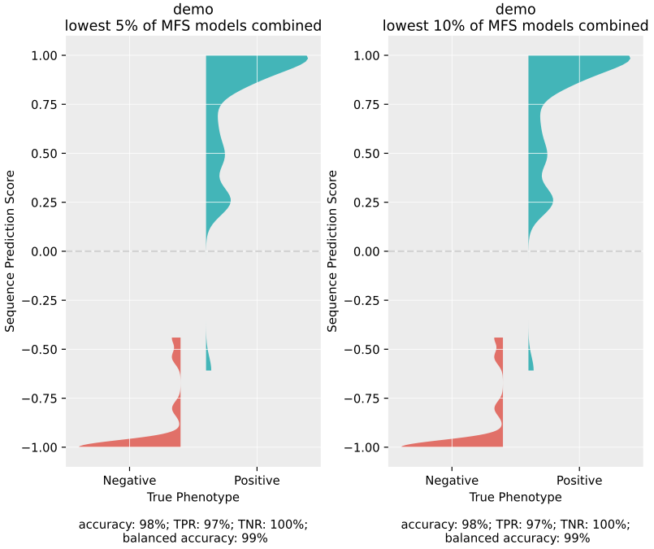

# Evolutionary Sparse Learning with Paired Species Contrast (ESL-PSC) #

## Table of Contents ##

1. [Description](#description)
2. [New: Graphical Interface now available!](#new-graphical-interface-now-available)
3. [CLI Usage](#cli-usage)
4. [Installation and Dependncies](#installation-and-dependncies)
5. [Using a Configuration File with ESL-PSC Scripts](#using-a-configuration-file-with-esl-psc)
6. [Input Data](#input-data)
7. [Output Data](#output-data)
8. [Additional Options and Parameters](#additional-options-and-parameters)
9. [Included Data](#included-data)
10. [Demo](#demo)
11. [Troubleshooting](#troubleshooting)
12. [Citation](#citation)

## Description ##
The tools presented in this repository allow one to analyse signatures of molecular convergence in an MSA using Evolutionary Sparse Learning with Paired Species Contrast (ESL-PSC). The main script, esl_multimatrix.py, takes in various input parameters and options to control the analysis process. It preprocesses input data, performs gap-cancellation, creates response matrices, and generates models over many combinations of sparsity parameters. The outputs include a gene ranking file, a species predictions predictions file, and plots to visualize the prediction results.

## New: Graphical Interface now available! ##
More details coming very soon.

## CLI Usage ##
To use ESL-PSC, you will need to run the **esl_multimatrix.py script** with the necessary arguments and options. You can provide the input parameters and options through the command line or by creating a configuration file called esl_psc_config.txt. When using a configuration file, provide one argument per line.

Here is an example of how to run the script:

`python esl_multimatrix.py --output_file_base_name output_file_name --species_groups_file /path/to/species_groups_file  --alignments_dir /path/to/alignments/dir --use_logspace --cancel_only_partner`

##### We also include `esl_multimatrix.exe` which can be substituted for `esl_multimatrix.py` in the above command and will run on Windows. 

To see all of the options available for any of the scripts in this directory, you can use `python [script_name].py --help`

See [Demo](#demo) for an example of a run command you can try with an included data set.

## Installation and Dependncies ##

When running on Windows using `esl_multimatrix.exe` all dependencies are included and no further installations are necessary.

When running ESL-PSC using the included python scripts, it requires a linux operating system and python 3. It has been tested using Ubuntu 20 with Python 3.8. The following Python libraries are required:

- BioPython
- NumPy
- pandas
- matplotlib
- seaborn

You can install these libraries using pip:

`pip install biopython numpy pandas matplotlib seaborn`

ESL-PSC can be run on Windows by substituting 

### Using a Configuration File with ESL-PSC ###

ESL-PSC scripts can utilize a configuration file to easily manage arguments that remain constant across multiple runs. The scripts will check for the presence of an esl_psc_config.txt file in the current working directory. If it exists, the function reads the arguments from the file and combines them with any additional command-line arguments provided when running the script. This allows you to keep common arguments in the configuration file, while providing run-specific arguments via the command line.

To use this feature:

1. An existing esl_psc_config.txt file is included in the directory with the ESL-PSC scripts. 

2. Add any desired arguments to the esl_psc_config.txt file, using the same format as you would when providing them on the command line. Each argument should be on a new line, followed by its corresponding value. For example: `--pheno_names phenotype_1 phenotype_2`

3. Save the `esl_psc_config.txt` file.

4. When running an ESL-PSC script, the scripts will automatically check for the presence of the esl_psc_config.txt file and incorporate its contents. Command-line arguments will override the values in the config file if both are provided for the same argument.

5. If the esl_psc_config.txt file is not found in the current working directory, the function will only parse command-line arguments.

## Input Data ##

#### The main input files required for ESL-PSC are: ####

1. A directory of alignment files. These should be in **2-line fasta format** and whose file names must have the file extension `.fas`. Each sequence must be entirely on a single line below the line containing its identifier. If the sequence is split over multiple lines, it will cause an error. It is assumed that each seperate alignment file will be a different genomic component, such as a gene, a protein, an exon, a domain, etc. and each component will be treated as a "group" of sites in the analysis (see Methods in Allard et al., 2025). Use the argumemnt `--alignments_dir` and give the full absolute path to the directory.

2. A species groups file.  This is a text file that contains a comma delimited list of species on each line. In the simplest case, one species identifier can be placed on each line. The first line must contain one or more species that possess the convergent trait under analysis, and the next line must contain one or more species that can serve as trait-negative controls for the species in the first line, such that the first two lines, and each subsequent pair of lines will define a contrast pair of species to use in the analysis (see Allard et al., 2025 for details on chosing contrast pairs for ESL-PSC analysis). When more than one species is given in a line, each of those species will be used in a seperate analysis, along with all combinations of other alternative speices.  Thus, the total number of species combinations can be calculated by the product of the number of species given on each line. In the analysis, species listed on the first line, and subsequent odd numbered lines, will be assigned a response value of 1, and the associated control species on the even numbered lines will be assigned a response value of -1. Use the argument `--species_groups_file` and give the full absolute path to the file.

#### Optional input files: ####

1. A species phenotype file. This is a text file which has each in the full  species name followed by a comma and then a 1 or -1 for the true phenotype class to which that species belongs. A 1 typically refers to the convergent phenotype. If this file is not provided, the ture phenotype will not be listed for each species prediction in the species_predictions output file. Use the argument `--species_pheno_path` and give the full absolute path to the file.

2. A directory of alignments to use for preditions. By default, any species in the input alignments that are not used in building any given model will be assigned a sequence prediction score (SPS) for that model, which will be included in the predictions output file. As an alternative, you can use a seperate directory of alignments for the predictions, however these still need to be fully aligned to any input species alignments or the predictions will be meaningless. Use the argument `--prediction_alignments_dir` and give the full absolute path to the directory.

3. Canceled alignments directory. Full path to the new alignments directory. Gap-canceled alignments for each species combo will be placed here. This may also be an existing folder of gap-canceled alignments for multimatrix ESL-PSC. Use the argument `--canceled_alignments_dir` and give the full absolute path to the directory.

4. Limited genes list. If you want to use a subset of the alignment files for model building without having to remove files from your alignments directory, you can submit a limited genes list file, which is a text file containing one alignment file name on each line. Note that these names must exactly match the ones in the alignments directory, and must end in `.fas` like they do. Use the argument `--limited_genes_list` and give the full absolute path to the file.

## Output Data ##

ESL-PSC generates two main types of output files: a Predictions File and a Gene Ranks File. These files will be placed in the ESL-PSC directory.

#### Predictions File ####
The predictions file contains every prediction made by every model generated using every species combination in the analysis. Each line in the file lists the following information:

1. Species combination (an abrevaited list of the species used to train the model. for very large numbers of species, a name like combo_1 will be assigned instead for each combination)
2. Lambda1 (first sparsity hyperparameter)
3. Lambda2 (second sparsity hyperparameter)
4. Penalty term (the constant term used to calculate the group penalty, see hyperparameters below for details)
5. Number of genes (the number of genes/protein
6. Input Root Mean Squared Error (RMSE; this is referred to as the Model Fit Score (MFS) by Allard et al. (2025))
7. Species being predicted
8. Sequence Prediction Score (SPS) (a negative value indicates a prediction of the phenotype assigned a response value of -1 and a positive value indicates a prediction of opposite phenotype) 
9. True phenotype for the species (taken from the species_pheno_file if provided)

#### Gene Ranks File ####
The gene ranks file lists the genes (or proteins or other genomic components) used in the analysis, along with information about their rankings based on their model contributions. It is recommended to perform ontology enrichment tests and/or other follow-up analyses on the highest ranking ~1% of genetic elements. Each line in the file includes the following information:

1. Gene name (taken from the alignment file)
2. Number of species combinations in which the gene is ranked (i.e. number of combinations for which it recieved a non-zero GSS as part of any model)
3. Number of species combinations in which the gene is ranked among the top contributors (the percentage of genes to consider "top genes" by GSS in any model can be set using the `--top_rank_frac` argument.)
4. Highest ever Group Sparsity Score (GSS)
5. Best ever rank (the best ever rank, 1 being the best possible, recieved in any model)

## Additional Options and Parameters ##

The following additional options and parameters can be specified when running ESL-PSC to fine-tune the analysis and control various aspects of the process. These options can be added as command line arguments or specified in the config file. 

Note that the word the word "gene" is used here to refer to the genomic components treated as "groups" of sites in the analysis, but these can of course be any aligned segments of biological sequences, e.g. proteins, exons, etc.

##### Hyperparameters:
* `--initial_lambda1`: Initial lambda 1 value (position sparsity parameter). Default = .01.
* `--final_lambda1`: Final lambda 1 value (position sparsity parameter). Default = .99.
* `--initial_lambda2`: Initial lambda 2 value (group sparsity parameter). Default = .01.
* `--final_lambda2`: Final lambda 2 value (group sparsity parameter). Default = .99.
* `--lambda_step`: The increment to increase the lambda values with each step. It is recommended to use a logspace (see options below) but in a linear gridsearch of sparsity hyperparameters, this controls the step between values.
* `--group_penalty_type`: Group penalty calculation type ("sqrt", "median", "linear", or "default"). Median will be used by default (see Methods in Allard et al., 2025)
* `--initial_gp_value`: Group penalty constant term initial value. If a linear group lenalty type is selected, the group penalties for each gene will be equal to the number of variable sites in the gene's alignment plus a constant term that is the same across all genes. By default, this will be 1 for all genes, but it is also possible to use a range of different constant terms and repeat all model ensembles for each group penalty term. In order to do this, the initial, final and step can be set using this and the following two arguments.
* `--final_gp_value`: Group penalty constant term final value. See initial_gp_value above for explanation.
* `--gp_step`: Group penalty constant term increment. The default is 6. See initial_gp_value above for explanation.
* `--num_log_points`: The number of values per sparsity hyperparameter (lambda1 and lambda2) in a logspace of values to test. Include the `--use_logspace` flag (see options below).
* `--pheno_names`: The names of the two phenotypes separated by a space, with the convergent phenotype coming first. by default "1" and "-1" will be used
* `--min_genes`: Minimum number of genes a model must have in order for that model to be included in the prediction scores plots. Default = 0.

##### Options:
* `--use_logspace`: *Recommended* Use a log space of points for lambda values instead of initial and final lambda values with a lambda step.
* `--use_existing_preprocess`: Use existing preprocess folder and skip running the preprocess step.
* `--use_default_gp`: Don't replace group penalties (automatically set to True if the group_penalty_type is "default").
* `--keep_raw_output`: Don't delete the raw model output files for each run. The raw models can be found in the preprocessed_data_and_outputs directory. You can also set a new directory by using the `--esl_inputs_outputs_dir` argument, but note that any files ending in .txt will be cleared from this directory before each ESL-PSC run.
* `--show_selected_sites`: Print a dictionary of all selected sites with their highest model score for every gene in the gene_ranks output file.
* `--no_genes_output`: Don't output a gene ranks file. If only predictions output is desired, including the option will speed up the analysis.
* `--no_pred_output`: Don't output a species predictions file. If only gene ranks output is desired, including the option will significantly speed up the analysis.
* `--make_sps_plot`: Make a violin plot showing SPS density for each true phenotype (SPS of > 1 or < -1 as 1 and -1 by default).
* `--make_sps_kde_plot`: Make a KDE plot showing SPS density for each true phenotype. Both plot types will produce two plots, one which includes models in the lowest 5% of MFS and one that includes models in the lowest 10% (see Methods in Allard et al., 2025)

##### Deletion Canceler Options:
* `--nix_full_deletions`: Don't create new files for fully canceled genes, i.e. if enough species are missing the entire alignment is excluded.
* `--cancel_only_partner`: Only cancel partner of any gap species at the site instead of eliminating the entire column.
* `--min_pairs`: The minimum number of pairs that must not have gaps or the whole site will be canceled.
* `--limited_genes_list`: Use only genes in this list. One file per line.

##### Multimatrix-specific Optional Arguments:
* `--top_rank_frac`: Fraction of genes to count as "top genes."  The default is .01 (1%)
* `--response_dir`: Folder with response matrices. Any txt file in this folder is assumed to be a response matrix file.
* `--use_uncanceled_alignments`: Use the alignments_dir alignments for all matrices without doing gap canceling (not recommended).
* `--use_existing_alignments`: Use existing files in canceled_alignments_dir.
* `--delete_preprocess`: Clear preprocess folders after each matrix run.
* `--make_null_models`: Make null response-flipped ESL-PSC models. Must have an even number of pairs. All balanced flippings of the response values will be generated for each combo and all will be run and aggregated to maximally decouple true convergences (see Methods in Allard et al., 2025). 
* `--make_pair_randomized_null_models`: Make null pair randomized ESL-PSC models. A copy of input deletion-canceled alignment will, for each variable site, be randomized such that the residues of each contrast pair will be either flipped or not and the ESL-PSC integration will be repeated for each one. The results are then aggregated for all (see Methods in Allard et al., 2025).
* `--num_randomized_alignments`: Number of pair-randomized alignments to make. Default is 10.

## Included Data ##

#### We have included two sample species_groups files for use in ESL-PSC alignments ####
1. photo_single_LC_matrix_species_groups.txt (the grass species with the closest contrast partners with the longest sequences (i.e. fewest gaps; used for photosynthesis analyses in Allard et al., (2025))
2. orthomam_echo_species_groups.txt (this can be used to reproduce the echolocation analyses using all 16 species combinations (Allard et al., 2025) 

A species phenotype file for the grass species has also been included: photo_species_phenotypes.txt

#### We have included the protein sequence alignments used for ESL-PSC analyses by Allard et al. (2025). If you use these data, please cite these sources: ####

##### Grass chloroplast alignments which were used by Allard et al. (2025) were derived from:

Casola C, Li J. 2022. Beyond RuBisCO: convergent molecular evolution of multiple chloroplast genes in C4 plants. PeerJ 10:e12791 https://doi.org/10.7717/peerj.12791
More information regarding these alignments can be found in the supplemental information kindly provided online by these authors.

##### Mammalian protein sequence alignments for echolocators and their control species were derived from the OrthoMaM database:
https://orthomam.mbb.cnrs.fr/#

OrthoMaM v10: Scaling-Up Orthologous Coding Sequence and Exon Alignments with More than One Hundred Mammalian Genomes Celine Scornavacca, Khalid Belkhir, Jimmy Lopez, Rémy Dernat, Frédéric Delsuc, Emmanuel J P Douzery, Vincent Ranwez Molecular Biology and Evolution, Volume 36, Issue 4, April 2019, Pages 861–862

## Troubleshooting ##

Problems with the inputs can cause segmentation fault errors in the ESL preprocess step. Here are some common causes of problems:
1. An incorrect file path. It is recommended to use absolute file paths. Dragging the file icon onto the terminal window is a good way to make sure the path is entered correctly.
2. Misspelling a species name. It is recommended to copy and paste the species identifiers from the alignment file when you set up your species groups file.  It's easy to miss a slight spelling error.
3. Having an extra blank new line in one of the input files.
4. having a duplicate alignment file name.
5. It is very easy to miss adding a ".txt" or other extension to one of the files names in the run command.

## Demo ##
You can run an ESL-PSC analysis of the C3/C4 trait with the included chloroplast data by following the steps below: 
1. Clone this repository
2. Make sure you have the dependencies installed (see [Installation and Dependncies](#installation-and-dependncies) above). You will need 
3. Navigate to the `ESL_PSC/` directory on your computer
4. Unzip the `photosynthesis_alignments.zip` archive: `tar -xf photosynthesis_alignments.zip`
5. Run this command from the ESL-PSC directory: `python esl_multimatrix.py --output_file_base_name demo_output --species_groups_file photo_single_LC_matrix_species_groups.txt --alignments_dir photosynthesis_alignments/ --use_logspace --num_log_points 20 --cancel_only_partner --species_pheno_path photo_species_phenotypes.txt --make_sps_plot --pheno_names "C4" "C3"`
6. The expected run time is approximately 30 seconds on a standard desktop computer.
7. A set of violin plots depeicting the prediction scores for C3 and C4 species will be displayed on the screen. The gene ranks (`demo_output_gene_ranks.csv`) and species prediction (`demo_output_species_predictions.csv`) csv files will be found in the ESL_PSC directory
the plot should look like this:

8. See [Output Data](#output-data) above for descriptions of the fields in the output csv files.

## Citation ##
If you use this software in your research, please cite our paper:

John B. Allard, Sudip Sharma, Ravi Patel, Maxwell Sanderford, Koichiro Tamura, Slobodan Vucetic, Glenn S. Gerhard & Sudhir Kumar. Evolutionary sparse learning reveals the shared genetic basis of convergent traits. Nature Communications 16, 3217 (2025). https://doi.org/10.1038/s41467-025-58428-8

