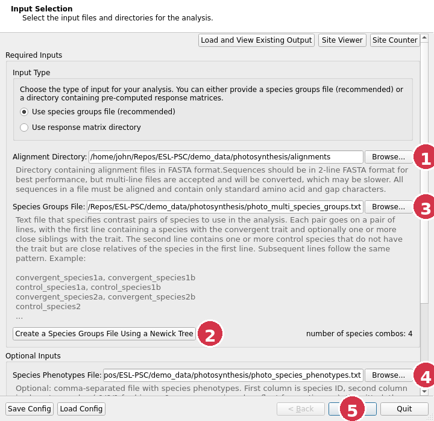
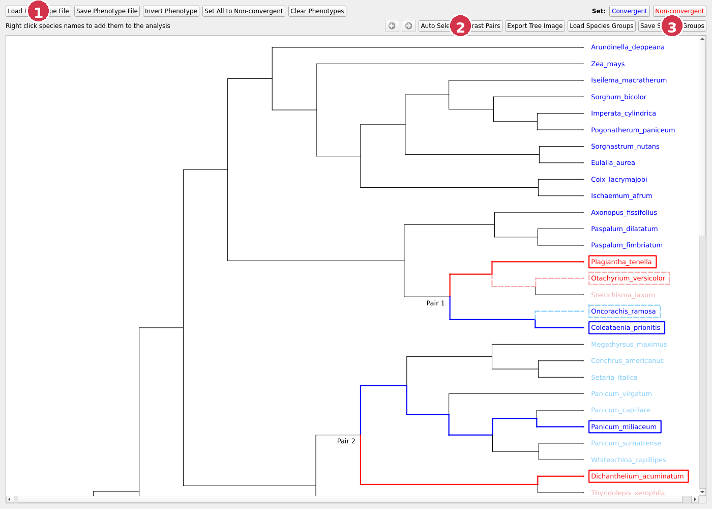
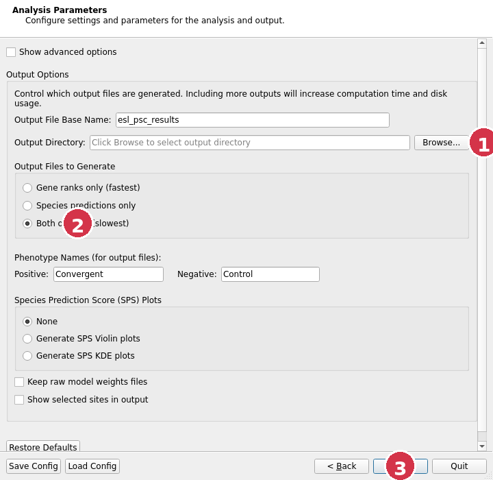

# GUI Quick Start

This guide is for first-time users who want the desktop app and do not want to set up the command line.

## Download and install

Pick the download that matches your computer:

- If you use a Mac, download [`ESL-PSC-v2.4.1-macOS.dmg`](https://github.com/John-Allard/ESL-PSC/releases/download/v2.4.1/ESL-PSC-v2.4.1-macOS.dmg)
- If you use a Windows PC, download [`ESL-PSC-v2.4.1-Windows.zip`](https://github.com/John-Allard/ESL-PSC/releases/download/v2.4.1/ESL-PSC-v2.4.1-Windows.zip)
- If you use Ubuntu or Debian Linux, download [`esl-psc-gui_2.4.1_amd64.deb`](https://github.com/John-Allard/ESL-PSC/releases/download/v2.4.1/esl-psc-gui_2.4.1_amd64.deb)


Install the app:

### Mac

1. Download the `.dmg` file.
2. Open it.
3. Drag `ESL-PSC.app` into your `Applications` folder.
4. Open `ESL-PSC` from `Applications`, Launchpad, or Spotlight.

### Windows

1. Download the `.zip` file.
2. Open it and choose **Extract All**.
3. Open the extracted folder.
4. Double-click `ESL-PSC.exe`.

Windows may warn that the app is unsigned. If that happens, click **More info**, then **Run anyway**.

### Ubuntu or Debian Linux

1. Download the `.deb` file.
2. Double-click it and install it with your normal software installer.
3. Open `ESL-PSC` from your app menu.

If you prefer the terminal on Linux, you can also install it with:

```bash
sudo dpkg -i esl-psc-gui_2.4.1_amd64.deb
```

## Getting started

Before you open the program, gather these files:

- a folder of alignment files in FASTA format
- a Newick tree file
- optionally, a CSV file with phenotype annotations

The phenotype CSV is helpful for tree coloring and for prediction summaries, but it is not required to start.

### 1. Fill in the Input page



1. Choose the folder that contains your alignments.
2. Click **Create a Species Groups File Using a Newick Tree**. A file chooser will open so you can pick your Newick tree.
3. After you save a species groups file from the tree viewer, it will appear here.
4. If you have a phenotype CSV file, choose it here. This is optional.
5. Click **Next**.

### 2. Build a species groups file from the tree



1. If you have a phenotype CSV file, load it here so the tree can color the species labels.
2. Click **Auto Select Contrast Pairs** to let the program choose a set of valid pairs from the tree.
3. Click **Save Species Groups** and choose where to save the file.

After you save the species groups file, close the tree viewer and return to the main wizard. The species groups path should now be filled in on the Input page automatically.

### 3. Use the defaults on the Parameters page



1. Choose an output folder for the results.
2. For a first run, leave the rest of this page at the defaults.
3. Click **Next**.

### 4. Skip the Command page

The next page shows the exact terminal command that the GUI is going to run.

Most users do not need to do anything here. You can simply click **Next** again.

### 5. Run the analysis

On the final page:

1. Click **Run Analysis**.
2. Watch the progress in the built-in terminal panel.
3. When the run finishes, move on to the results page to inspect the ranked genes, predictions, and selected sites.

## First practice run

If you want to practice with the bundled demo data first, use:

- alignments folder: `demo_data/photosynthesis/alignments`
- tree file: `demo_data/photosynthesis/photo_tree.nwk`
- phenotype file: `demo_data/photosynthesis/photo_species_phenotypes.txt`

The repository also includes a ready-made GUI config at `demo_data/photosynthesis/demo_config_for_gui.json`.
